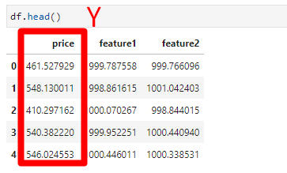
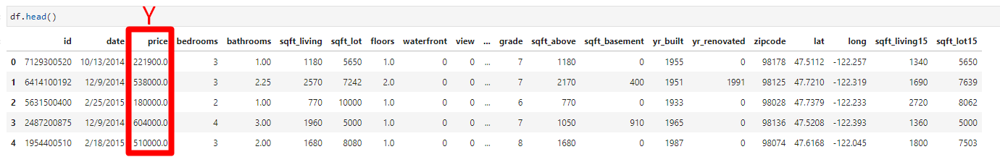
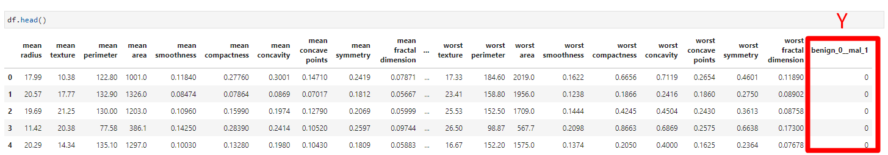
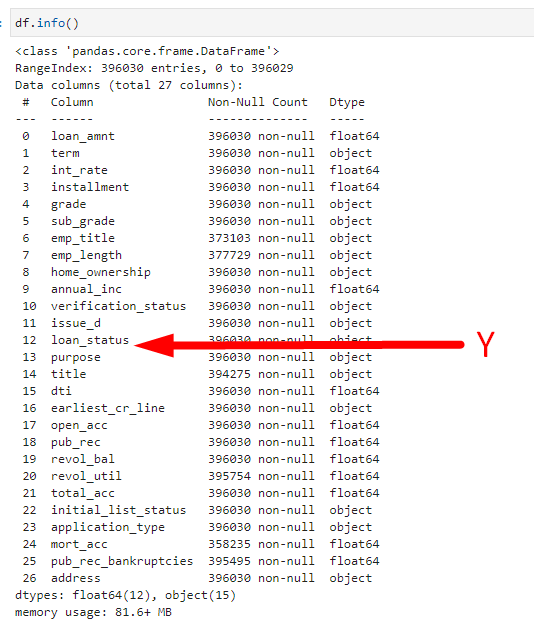

# Artificial-Neural-Networks

Pretend this data are measurements of some rare gem stones, with 2 measurement features and a sale price. Our final goal would be to try to predict the sale price of a new gem stone we just mined from the ground, in order to try to set a fair price in the market.

Test/Train Split

Normalizing/Scaling the Data

TensorFlow 2.0 Syntax

Model - as a list of layers or adding in layers one by one

For a mean squared error regression problem
model.compile(optimizer='rmsprop',
              loss='mse')
              
Sample: one element of a dataset.

Example: one image is a sample in a convolutional network. Example: one audio file is a sample for a speech recognition model

Batch: a set of N samples. The samples in a batch are processed independently, in parallel. If training, a batch results in only one update to the model.A batch generally approximates the distribution of the input data better than a single input. The larger the batch, the better the approximation; however, it is also true that the batch will take longer to process and will still result in only one update. For inference (evaluate/predict), it is recommended to pick a batch size that is as large as you can afford without going out of memory (since larger batches will usually result in faster evaluation/prediction).

Epoch: an arbitrary cutoff, generally defined as "one pass over the entire dataset", used to separate training into distinct phases, which is useful for logging and periodic evaluation.

When using validation_data or validation_split with the fit method of Keras models, evaluation will be run at the end of every epoch.

Within Keras, there is the ability to add callbacks specifically designed to be run at the end of an epoch. Examples of these are learning rate changes and model checkpointing (saving).

Evaluation

Compare final evaluation (MSE) on training set and test set

Further Evaluations

Predicting on brand new data

Saving and Loading a Model

EDA: isnull, sns.displot(df['price']), df.corr()['price'].sort_values(), sns.scatterplot(x='price',y='sqft_living',data=df), sns.boxplot(x='bedrooms',y='price',data=df), sns.scatterplot(x='long',y='lat',data=df,hue='price')

Let us only use bottom 99% of data based on price to cut off outliers: non_top_1_perc = df.sort_values('price',ascending=False).iloc[216:]

Working with Feature Data - Feature Engineering to remove features that are not important

Feature Engineering from Date: df['date'] = pd.to_datetime(df['date']), df['month'] = df['date'].apply(lambda date:date.month)

Feature Engineering needs to consider if should convert a number-like category column to dummies OR keep its continuous number values makes more sense!

Scaling and Train Test Split

Scaling

Creating a Model: Because we have 19 incoming features, 19 nerons in each layer

Training the Model: model.fit(x=X_train,y=y_train,
          validation_data=(X_test,y_test),
          batch_size=128,epochs=400)

validation_data=(X_test,y_test) will not affect weights/bias of the network

Keras will only use training data to update weight/bias and see how it is doing on training and validation data!

Smaller batch size, longer training to take, less likely to overfit your data because you are not passing in your entire training. Instead, focusing smaller batches.

Shows losses on training set and validation data: Take the mse of predictions against true values and try to minimize that through optimizer

Predicting on Brand New Data: mean_absolute_error(y_test,predictions), plt.scatter(y_test,predictions), errors = y_test.reshape(6480, 1) - predictions

Predicting on a brand new house: predicted-287402.97, actual-221900.0000

EDA: sns.countplot(x='benign_0__mal_1',data=df), sns.heatmap(df.corr()), df.corr()['benign_0__mal_1'].sort_values().plot(kind='bar')

Train Test Split

Scaling Data

Creating the Model: # For a binary classification problem
model.compile(optimizer='rmsprop',
              loss='binary_crossentropy',
              metrics=['accuracy'])
              
Training the Model: 

Example One: Choosing too many epochs and overfitting! Overfitting: Loss still going down, but orange is going up for epochs.

Example Two: Early Stopping. We obviously trained too much! Let's use early stopping to track the val_loss and stop training once it begins increasing too much!

Example Three: Adding in DropOut Layers. model.add(Dropout(0.5)), 0.5 percent neurons are going to be turned off for each batch. Better result, blue and orange are flattening out at same epoch!

Model Evaluation: predictions = model.predict_classes(X_test). print(classification_report(y_test,predictions)). print(confusion_matrix(y_test,predictions)).

Goal: Given historical data on loans given out with information on whether or not the borrower defaulted (charge-off), can we build a model thatcan predict wether or nor a borrower will pay back their loan? This way in the future when we get a new potential customer we can assess whether or not they are likely to pay back the loan. 

EDA: sns.countplot(x='loan_status',data=df), sns.displot(df['loan_amnt'],kde=False,bins=40), sns.heatmap(df.corr(),annot=True,cmap='viridis'), sns.boxplot(x='loan_status',y='loan_amnt',data=df), df.groupby('loan_status')['loan_amnt'].describe(), sns.countplot(x='sub_grade',data=df,order = subgrade_order,palette='coolwarm' ,hue='loan_status')

Create a new column called 'load_repaid' which will contain a 1 if the loan status was "Fully Paid" and a 0 if it was "Charged Off".

Create a bar plot showing the correlation of the numeric features to the new loan_repaid column: df.corr()['loan_repaid'].sort_values().drop('loan_repaid').plot(kind='bar')

Data PreProcessing - Convert categorical string features to dummy variables.

Section Goals: Remove or fill any missing data. Remove unnecessary or repetitive features. Convert categorical string features to dummy variables.

Create a Series that displays the total count of missing values per column: df.isnull().sum()

Let's examine emp_title and emp_length to see whether it will be okay to drop them. Print out their feature information using the feat_info() function from the top of this notebook.

Realistically there are too many unique job titles to try to convert this to a dummy variable feature. Let's remove that emp_title column.

Create a count plot of the emp_length feature column. Challenge: Sort the order of the values: sns.countplot(x='emp_length',data=df,order=emp_length_order,hue='loan_status')

percentage of charge offs per category: informing us what percent of people per employment category didn't pay back their loan!

emp_co = df[df['loan_status']=="Charged Off"].groupby("emp_length").count()['loan_status']

emp_fp = df[df['loan_status']=="Fully Paid"].groupby("emp_length").count()['loan_status']

emp_len = emp_co/emp_fp

Charge off rates are extremely similar across all employment lengths. So drop the emp_length column!

Review the title column vs the purpose column. Is this repeated information? The title column is simply a string subcategory/description of the purpose column. Go ahead and drop the title column.

Create a value_counts of the mort_acc column. There are many ways we could deal with this missing data. We could attempt to build a simple model to fill it in, such as a linear model, we could just fill it in based on the mean of the other columns, or you could even bin the columns into categories and then set NaN as its own category. There is no 100% correct approach! Let's review the other columsn to see which most highly correlates to mort_acc

df.corr()['mort_acc'].sort_values()

Looks like the total_acc feature correlates with the mort_acc , this makes sense! Let's try this fillna() approach. We will group the dataframe by the total_acc and calculate the mean value for the mort_acc per total_acc entry. 

Group the dataframe by the total_acc and calculate the mean value for the mort_acc per total_acc entry: df.groupby('total_acc').mean(). This serves as a lookup table!

Let's fill in the missing mort_acc values based on their total_acc value. If the mort_acc is missing, then we will fill in that missing value with the mean value corresponding to its total_acc value from the Series we created above. This involves using an .apply() method with two columns. 

df['mort_acc'] = df.apply(lambda x: fill_mort_acc(x['total_acc'], x['mort_acc']), axis=1)

revol_util and the pub_rec_bankruptcies have missing data points, but they account for less than 0.5% of the total data. Go ahead and remove the rows that are missing those values in those columns with dropna().

Categorical Variables and Dummy Variables

Convert the term feature into either a 36 or 60 integer numeric data type using .apply() or .map().

Convert the subgrade into dummy variables. Then concatenate these new columns to the original dataframe. 

Convert these columns: ['verification_status', 'application_type','initial_list_status','purpose'] into dummy variables and concatenate them with the original dataframe. Remember to set drop_first=True and to drop the original columns. dummies = pd.get_dummies(df[['verification_status', 'application_type','initial_list_status','purpose' ]],drop_first=True).

Review the value_counts for the home_ownership column. df['home_ownership'].value_counts(). Convert these to dummy variables, but replace NONE and ANY with OTHER, so that we end up with just 4 categories, MORTGAGE, RENT, OWN, OTHER. Then concatenate them with the original dataframe. Remember to set drop_first=True and to drop the original columns.

Let's feature engineer a zip code column from the address in the data set. Create a column called 'zip_code' that extracts the zip code from the address column. df['zip_code'] = df['address'].apply(lambda address:address[-5:]).

issue_d: This would be data leakage, we wouldn't know beforehand whether or not a loan would be issued when using our model, so in theory we wouldn't have an issue_date, drop this feature.

earliest_cr_line: df['earliest_cr_year'] = df['earliest_cr_line'].apply(lambda date:int(date[-4:]))

Train Test Split

